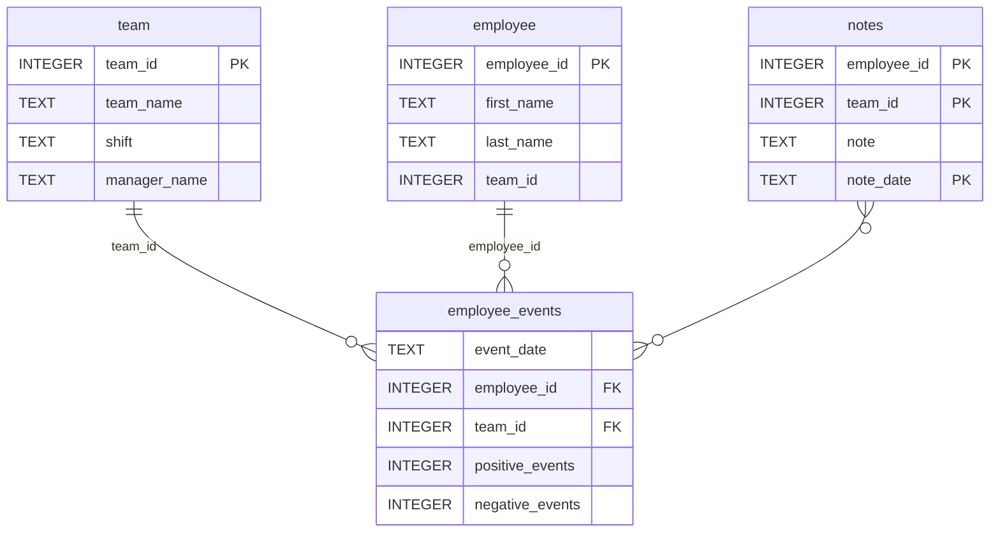

# DSND Dashboard Project

## Overview
This project is a dashboard application for visualizing and analyzing employee events data. It was developed as part of a Data Scientist course. The project uses Python, FastHTML, and various data science libraries to build interactive visualizations and reports.

## Requirements
- Python 3.11 or higher
- Virtual environment tool (venv)
- pip

## Project Structure
```
├── README.md
├── assets
│   ├── model.pkl
│   └── report.css
├── github/workflows
│   ├── python-app.yml
├── python-package
│   ├── employee_events
│   │   ├── __init__.py
│   │   ├── employee.py
│   │   ├── employee_events.db
│   │   ├── query_base.py
│   │   ├── sql_execution.py
│   │   └── team.py
│   ├── requirements.txt
│   ├── setup.py
├── report
│   ├── __init__.py
│   ├── base_components
│   │   ├── __init__.py
│   │   ├── base_component.py
│   │   ├── data_table.py
│   │   ├── dropdown.py
│   │   ├── matplotlib_viz.py
│   │   └── radio.py
│   ├── combined_components
│   │   ├── __init__.py
│   │   ├── combined_component.py
│   │   └── form_group.py
│   ├── dashboard.py
│   └── utils.py
├── requirements.txt
├── start
├── tests
    └── test_employee_events.py

```

### Database Schema (`employee_events.db`)


## Installation

1. Create a virtual environment:
python -m venv venv

2. Activate the environment:
Windows PowerShell: venv\Scripts\Activate.ps1
CMD: venv\Scripts\activate.bat

3. Install dependencies:
pip install -r requirements.txt

Note: Some package versions have been updated from the original requirements to ensure compatibility with local development in VSCode. These updates may require minor adaptations in the code. Examples:

python-fasthtml updated from 0.8.0 → 0.12.24
scipy updated from 1.14.1 → 1.16.1
numpy updated from 2.1.2 → 2.3.2
pandas updated from 2.2.3 → 2.3.2

These updates may require minor adaptations in the code when using the newer versions.

4. Build and install the local Python package:
cd python-package
python setup.py sdist
pip install dist/employee_events-0.1.0.tar.gz

## Usage
After installation, you can run the dashboard application or execute the tests:

- Run the dashboard:
  uvicorn report.dashboard:app

- Run tests:
  pytest tests/

## Contributing
Contributions are welcome! Please follow the project’s code style (flake8) and run all tests before submitting changes.

## License
This project is licensed under the terms specified in LICENSE.txt.